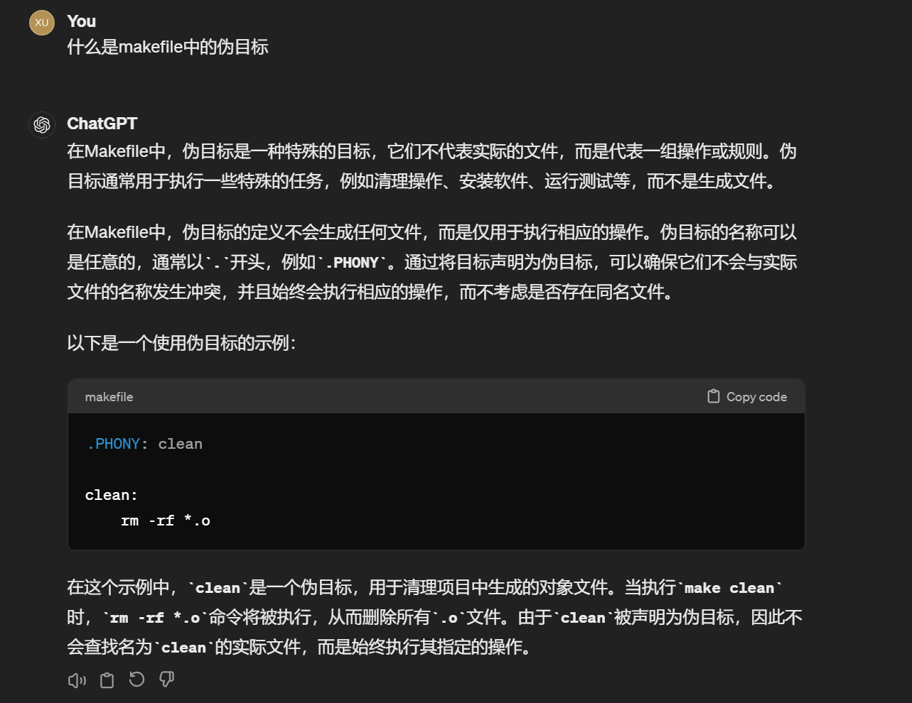

## 问题
最近在使用make编译go项目的时候忽然发现有一个项目即使没有任何修改，make也会重新编译这个项目。于是对Makefile进行了分析，找了半天发现build过程中依赖了一个伪目标（PHONY target）导致make无条件执行编译命令。
这是由于make命令是通过文件被更新的时间戳来判断是否需要执行当前命令，而被声明成伪目标的命令不会查找同名的实际文件，导致make在分析其时间戳的时候发现该伪目标对应的文件不存在，于是始终执行其指定的操作。简言之，在makefile中，伪目标总是会被执行。

首先我们先问问ChatGPT对伪目标的定义：

	
## 场景还原

最开始的makefile大概是这样的：

我们使用 `make -r -n -d` 对makefile进行分析：
可以看到其中我们定义的两个伪目标 `all` 和 `protoc` 在make的分析中都是不存在的文件，而我们的编译目标依赖于 `protoc` 所以make得出的结论是编译命令必须被执行。

## 问题解决

那么在这样的情况下，我们如何解决这个问题呢？
解决的方案有两个，第一个方案是把 `protoc` 从伪目标中删除，将其定义为一个文件目标，并在每次执行该目标时更新protoc文件。这种方案适用于那些本来就需要一些日志或文件输出的执行目标。下面给出方案一的解决代码：
但是原本的protoc命令并不需要任何输出，这样修改导致生成一个不需要的文件，有点多余的感觉。

解决方案二是定义一个新的变量，并让编译目标依赖此变量，代码如下：
makefile中的变量会在执行时进行展开，相当于把变量中的所有目标列在编译目标中。
